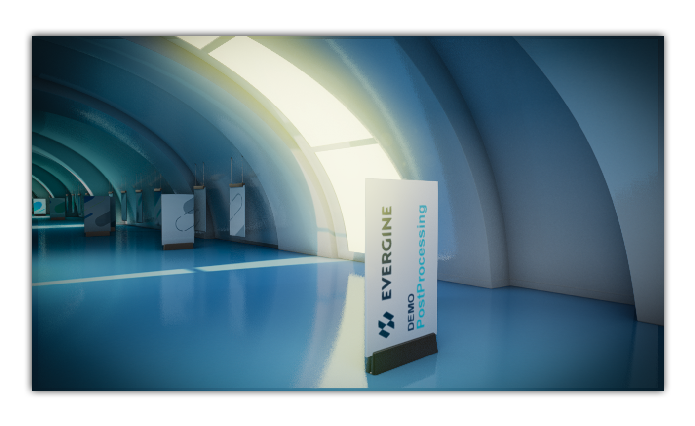

# Evergine Postprocessing Demo

This demo scene uses Evergine with .NET 6 support. The new Post-processing graph is used with several effects such as _Screen Space Ambient Occlusion (SSAO), Screen Space Reflection (SSR), Temporal Antialiasing (TAA), Depth of Field (DoF), Bloom,_ and _Tonemapping_.

Video: https://www.youtube.com/watch?v=YlygX3Hdp5I

## Build and Test

Required Visual Studio 2022 with .NET6 support

Open the project with Evergine Studio and select the Build & Run option from File menu.

### Special Keys
 * W,S,D,A: Camera movement.
 * T: Enable/Disable camera traveling animation
 * 1: Enable/Disable SSAO
 * 2: Enable/Disable SSR
 * 3: Enable/Disable DoF
 * 4: Enable/Disable Bloom
 * 5: Enable/Disable Tonemapping

----
Powered by **[Evergine](http://evergine.com)**

LET'S CONNECT!

- [Youtube](https://www.youtube.com/subscription_center?add_user=WaveEngineChannel)
- [Twitter](https://twitter.com/WaveEngineTeam)
- [Blog](http://geeks.ms/waveengineteam/)
